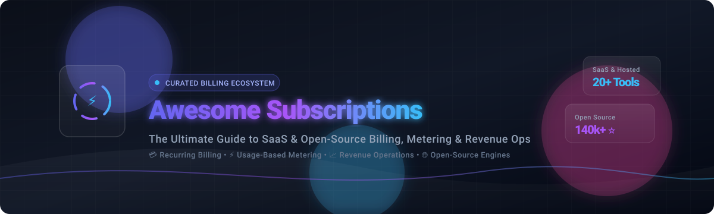

<div align="center">



# 💳 Awesome Subscriptions &amp; Billing Platforms 🚀

<p align="center">
  <a href="https://github.com/ishandutta2007/Awesome-Awesome-Awesome"></a>
  <a href="https://discord.gg/jc4xtF58Ve"></a>
  <a href="https://github.com/ishandutta2007/Awesome-Subscriptions/stargazers"></a>
  <a href="https://github.com/ishandutta2007/Awesome-Subscriptions/network/members"></a>
  <a href="https://github.com/ishandutta2007/Awesome-Subscriptions/pulls"></a>
  <a href="https://github.com/ishandutta2007/Awesome-Subscriptions/blob/main/LICENSE"></a>
  <a href="https://github.com/ishandutta2007"></a>
</p>

<p align="center">
  <strong>Curated Directory of SaaS Platforms &amp; Open-Source Billing Engines, Real-Time Metering Infrastructure, and Recurring Revenue Operations Tools.</strong>
</p>

---

</div>

## 📌 Overview &amp; SEO Summary

**Awesome-Subscriptions** is the definitive, developer-first catalog of subscription management platforms, recurring billing software, usage-based metering engines, and revenue operations infrastructure. Whether you are building an AI SaaS startup, modernizing an enterprise billing pipeline, or designing a self-hosted recurring-commerce system, this directory indexes both top-tier commercial SaaS providers and extensible open-source projects.

### 🔑 Core Keywords &amp; Topics
`Subscription Management` • `Recurring Billing` • `Usage-Based Metering` • `Revenue Operations` • `Merchant of Record (MoR)` • `Billing APIs` • `Open-Source Billing` • `Invoicing` • `Entitlements Engine` • `Payment Routing` • `Dunning Management` • `Fintech Infrastructure`

---

## 📑 Table of Contents

- [☁️ SaaS / Hosted Billing Platforms](#-saashosted-billing-platforms)
- [📦 Open-Source GitHub Projects](#-open-source-github-projects)
- [🏗️ Recommended Architectural Blueprints](#️-recommended-architectural-blueprints)
- [🤝 How to Contribute](#-how-to-contribute)
- [⭐ Star History](#-star-history)
- [📜 Disclaimer](#-disclaimer)

---

## ☁️ SaaS / Hosted Billing Platforms

> 📊 **Market Size &amp; Sector Concentration**: The global subscription management and recurring billing software market is estimated at **$6.4B – $9.2B in 2026** and projected to exceed **$18B – $20B by 2030** (CAGR of ~15–17%). The sector exhibits **moderate market concentration** rather than a winner-take-all monopoly—characterized by mega-scale payment giants and enterprise billing leaders alongside agile, high-growth usage-based and API-first metering platforms.

*Below are leading commercial SaaS and hosted platforms, sorted by **Company Size (Valuation / Revenue) in descending order**:*

| Platform | Company Size (Valuation / Revenue) | Description | Starting Pricing | Free Tier / Free Trial Limits |
| :--- | :--- | :--- | :--- | :--- |
| **[Stripe Billing](https://stripe.com/billing)** | **~$159B Valuation**<br>*(~$6.8B+ Revenue)* | Enterprise payment &amp; recurring/usage-based billing infrastructure integrated with Stripe's global network. | 0.7% of recurring billing volume | No free forever plan; free sandbox mode with unlimited test transactions &amp; configurable trials up to 730 days. |
| **[Chargebee](https://www.chargebee.com/)** | **~$3.5B Valuation**<br>*(~$203M Annual Revenue)* | Comprehensive subscription lifecycle, recurring billing, invoicing, and revenue operations platform. | $0/mo (Starter plan) | **Free forever** up to $250,000 in cumulative lifetime billing volume (0.75% overage fee beyond $250k). |
| **[Zuora](https://www.zuora.com/)** | **~$1.7B Valuation**<br>*(~$450M Annual Revenue)* | Enterprise monetization suite powering complex recurring, consumption, and hybrid billing models. | ~$75,000/year (enterprise contract) | No free forever plan; 14–30 day guided enterprise sandbox and demo upon request. |
| **[Paddle](https://www.paddle.com/)** | **~$1.4B Valuation**<br>*(~$91M ARR)* | Complete Merchant-of-Record (MoR) billing platform managing global taxes, localized compliance, and subscriptions. | 5% + $0.50 per transaction | No free forever plan; free sandbox testing environment and free ProfitWell Metrics subscription analytics. |
| **[Metronome](https://metronome.com/)** | **~$1.0B Valuation**<br>*(Acquired by Stripe; ~$25M+ ARR)* | High-performance usage-based billing and real-time metering infrastructure for software and AI platforms. | $0 base (Starter tier, pay-as-you-grow) | **Free Starter tier** for engineering teams with real-time event ingestion and native Stripe sync. |
| **[Orb](https://withorb.com/)** | **~$335M Valuation**<br>*(Acquired by Adyen; ~$4.3M ARR)* | Usage-based billing and rating engine engineered for complex multi-dimensional usage pricing models. | ~$500/mo (starting growth quote) | No free forever cloud tier; 14–30 day proof-of-concept (POC) sandbox available upon request. |
| **[Maxio](https://www.maxio.com/)** | **~$150M+ Valuation**<br>*(~$49M ARR)* | B2B SaaS financial operations and billing platform combining Chargify billing and SaaSOptics revenue analytics. | $599/mo (Grow plan, up to $100k/mo billings) | 30-day free trial; free developer sandbox ("Build" plan) with dummy gateways for test integrations. |
| **[Recurly](https://recurly.com/)** | **~$120M+ Valuation**<br>*(~$56M Annual Revenue)* | Subscription management and recurring billing platform focused on dunning automation and churn minimization. | $249/mo + 0.9% volume (Starter plan) | 90-day free trial; Starter plan includes first $40,000/mo in billing volume at no extra fee. |
| **[Moesif](https://www.moesif.com/)** | **~$40M+ Valuation**<br>*(Acquired by WSO2; ~$5M ARR)* | API analytics, developer observability, and real-time metered billing monetization platform. | $60/mo (Starter plan) | 14-day free trial with full platform access (no credit card required). |
| **[Amberflo](https://www.amberflo.io/)** | **~$30M+ Valuation**<br>*($20M funding raised; ~$2M ARR)* | Cloud metering and usage-based pricing platform for AI models, cloud compute, and API services. | $99/mo (Starter plan) | **Free forever plan** with up to 1,000,000 metered events per month; 30-day free trial on paid tiers. |
| **[Ordway](https://www.ordwaylabs.com/)** | **~$25M+ Valuation**<br>*($15M+ funding raised; ~$4M ARR)* | Smart billing and revenue automation engine handling complex contracts, usage charges, and multi-entity accounting. | ~$500/mo (custom annual contract) | No free forever plan; 14–30 day guided demo &amp; sandbox pilot upon request. |
| **[Sticky.io](https://www.sticky.io/)** | **~$20M+ Valuation**<br>*(~$6M ARR)* | High-volume subscription commerce and recurring billing platform optimized for direct-to-consumer businesses. | 1.0% of gross sales (Tier 1: up to $500K sales) | No free forever plan; guided enterprise sandbox and demo evaluation upon request. |
| **[Appstle](https://appstle.com/)** | **~$15M+ Valuation**<br>*(~$3M ARR)* | Specialized subscription management and customer portal platform for Shopify and digital e-commerce merchants. | $10/mo (Starter plan, up to $5k/mo revenue) | **Free forever plan** for up to $500/month in subscription revenue (0% transaction fees). |
| **[ChargeOver](https://chargeover.com/)** | **~$10M+ Valuation**<br>*(~$2M ARR)* | Automated recurring billing and accounts receivable software featuring zero-percentage-fee flat pricing. | $229/mo flat fee (unlimited invoices) | 30-day free trial with full sandbox account access (limited to test transactions). |
| **[Billsby](https://www.billsby.com/)** | **~$10M+ Valuation**<br>*(~$1.5M ARR)* | Flexible subscription billing platform offering customizable checkout flows and automated dunning tools. | $45/mo + 0.4% over $15k/mo (Core plan) | **Free plan ($0/mo)** with unlimited time and users for configuration and sandbox testing. |
| **[OpenMeter Cloud](https://openmeter.io/)** | **Part of Kong Inc. ($2B+ Val)**<br>*(Formerly OpenMeter)* | Managed cloud usage metering and billing infrastructure for APIs and AI tokens (Kong Konnect). | Custom volume-based pricing | **Free forever tier** with up to 1,000,000 metered events per month. |
| **[Lago Cloud](https://www.getlago.com/)** | **Early-Stage ($22M Raised)**<br>*(Hosted Lago)* | Fully managed cloud edition of the Lago open-source usage-based billing and metering engine. | Custom early-stage package | Free forever self-hosted open-source version (AGPLv3); contact for cloud POC/pilot. |
| **[Kill Bill / Aviate](https://killbill.io/)** | **Self-Funded / Private**<br>*(Enterprise Services)* | Managed enterprise deployment, SLA support, and accelerators built atop the Kill Bill core engine. | ~$40/mo (AWS Marketplace software fee) | Free forever self-hosted core (Apache 2.0); free hosted sandbox at cloud.killbill.io. |

---

## 📦 Open-Source GitHub Projects

*Open-source billing engines, metering infrastructure, financial switches, and composable commerce frameworks that can be self-hosted or customized. Sorted by **GitHub Star Count (descending)**:*

1. ⚡ **[Hyperswitch](https://github.com/juspay/hyperswitch)** [](https://github.com/juspay/hyperswitch/stargazers)  
   Open-source financial switch and high-throughput payment router written in Rust. Connects multiple payment processors, automates subscription retries, and eliminates single-vendor lock-in.

2. 🛍️ **[Medusa](https://github.com/medusajs/medusa)** [](https://github.com/medusajs/medusa/stargazers)  
   Leading open-source composable commerce engine. Extensible with subscription modules, custom recurring billing logic, multi-currency pricing, and automated fulfillment workflows.

3. 🛒 **[Saleor](https://github.com/saleor/saleor)** [](https://github.com/saleor/saleor/stargazers)  
   High-performance open-source GraphQL headless e-commerce platform built with Python &amp; Django, providing scalable foundations for digital subscription storefronts.

4. 📦 **[Spree Commerce](https://github.com/spree/spree)** [](https://github.com/spree/spree/stargazers)  
   Modular open-source headless e-commerce framework with extensive REST/GraphQL APIs, plugin ecosystems, and recurring order management extensions.

5. 🌊 **[Lago](https://github.com/getlago/lago)** [](https://github.com/getlago/lago/stargazers)  
   Developer-first open-source metering and usage-based billing API (AGPLv3). Powers complex usage-based, subscription, and hybrid pricing models with native Stripe, Adyen, and payment gateway connectors.

6. 🥷 **[Invoice Ninja](https://github.com/invoiceninja/invoiceninja)** [](https://github.com/invoiceninja/invoiceninja/stargazers)  
   Self-hosted open-source invoicing and recurring billing suite built on Laravel &amp; Flutter. Features multi-client management, payment processing, quotes, and automated subscription renewal cycles.

7. 🌋 **[Crater](https://github.com/crater-invoice/crater)** [](https://github.com/crater-invoice/crater/stargazers)  
   Open-source billing and invoicing software for freelancers and small businesses. Generates detailed invoices, manages client profiles, and automates recurring payment notifications.

8. ⚔️ **[Kill Bill](https://github.com/killbill/killbill)** [](https://github.com/killbill/killbill/stargazers)  
   Enterprise-grade open-source subscription billing and payments engine (Apache 2.0). Supports multi-tenancy, custom payment plugins, dunning workflows, invoicing, and real-time financial reporting.

9. 💎 **[Solidus](https://github.com/solidusio/solidus)** [](https://github.com/solidusio/solidus/stargazers)  
   Scalable Ruby on Rails open-source commerce framework engineered for complex subscription boxes, custom recurring commerce, and high-volume transaction processing.

10. 📄 **[InvoicePlane](https://github.com/InvoicePlane/InvoicePlane)** [](https://github.com/InvoicePlane/InvoicePlane/stargazers)  
    Lightweight, self-hosted open-source application designed for tracking quotes, issuing recurring invoices, and managing client billing accounts.

11. ⏱️ **[OpenMeter](https://github.com/openmeterio/openmeter)** [](https://github.com/openmeterio/openmeter/stargazers)  
    Real-time usage metering and entitlement platform built for AI tokens, APIs, and cloud services. Delivers sub-millisecond usage aggregation, Stripe integration, and scalable event ingestion.

12. 🌐 **[FOSSBilling](https://github.com/FOSSBilling/FOSSBilling)** [](https://github.com/FOSSBilling/FOSSBilling/stargazers)  
    Community-driven open-source client management, helpdesk, and automated billing software tailored for hosting providers, domain registrars, and digital service vendors.

13. 🏎️ **[Octane](https://github.com/octane-billing/octane)** [](https://github.com/octane-billing/octane/stargazers)  
    Open-source metering and billing infrastructure for developer-first applications, making it seamless to construct usage meters, track consumption, and issue transparent invoices.

---

## 🏗️ Recommended Architectural Blueprints

Modern subscription stacks combine specialized modular engines rather than relying on monolithic black boxes:

```
[ App / AI Service ]
       │
       ▼ (Usage Events)
[ OpenMeter (Real-Time Metering & Entitlements) ]
       │
       ▼ (Aggregated Metrics)
[ Lago / Kill Bill (Pricing Logic, Invoicing & Subscription Engine) ]
       │
       ▼ (Payment Requests)
[ Hyperswitch / Stripe (Payment Routing & Settlement) ]
       │
       ▼ (Financial Data)
[ Accounting & ERP (NetSuite, QuickBooks, Xero) ]
```

*   **For AI &amp; Usage-Based SaaS**: `OpenMeter` (real-time event streaming) $\rightarrow$ `Lago` (billing plans &amp; credit wallets) $\rightarrow$ `Stripe / Hyperswitch` (payment processing).
*   **For Enterprise B2B SaaS**: `Kill Bill` (multi-tenant recurring engine) $\rightarrow$ `Hyperswitch` (multi-processor failover) $\rightarrow$ ERP revenue recognition.
*   **For Subscription Commerce**: `Medusa` or `Solidus` (storefront &amp; subscription scheduling) $\rightarrow$ `Hyperswitch / Stripe` (recurring tokenization).

---

## 🤝 How to Contribute

Contributions are warmly encouraged! Help keep this repository comprehensive, unbiased, and current:

1. 🍴 **Fork the repository**.
2. 📝 **Add or update an entry** in `README.md` maintaining the established tabular format, verified pricing, and exact star badges.
3. 🔗 **Ensure accurate links** to official platforms and public GitHub repositories.
4. 🚀 **Submit a Pull Request (PR)** with a concise summary of changes.
5. ⭐ **Star the repo** if you find it helpful!

---

## ⭐ Star History

[](https://star-history.dera.page/#ishandutta2007/Awesome-Subscriptions&type=date&legend=top-left)

---

## 📜 Disclaimer

*This repository is an open, community-curated educational resource. All product names, logos, and trademarks belong to their respective owners. Pricing plans, free tier quotas, and corporate valuations fluctuate over time—verify the latest terms on each vendor's official portal prior to production architectural decisions.*

<div align="center">
  <sub>Maintained with ❤️ by the open-source community for founders, software engineers, and revenue operations leaders.</sub>
</div>
